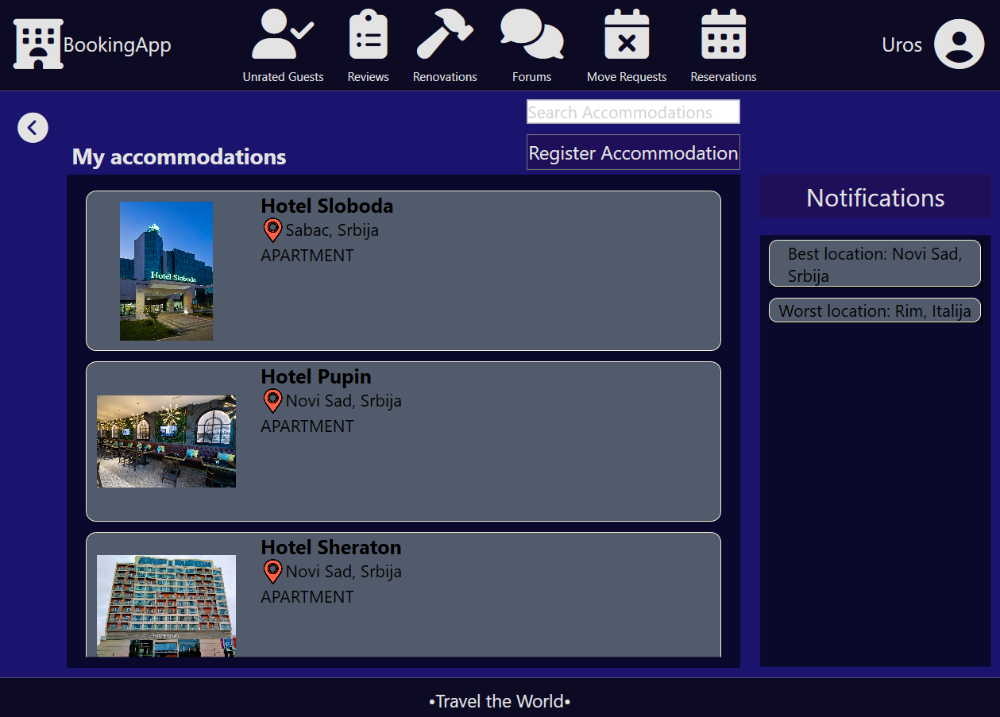
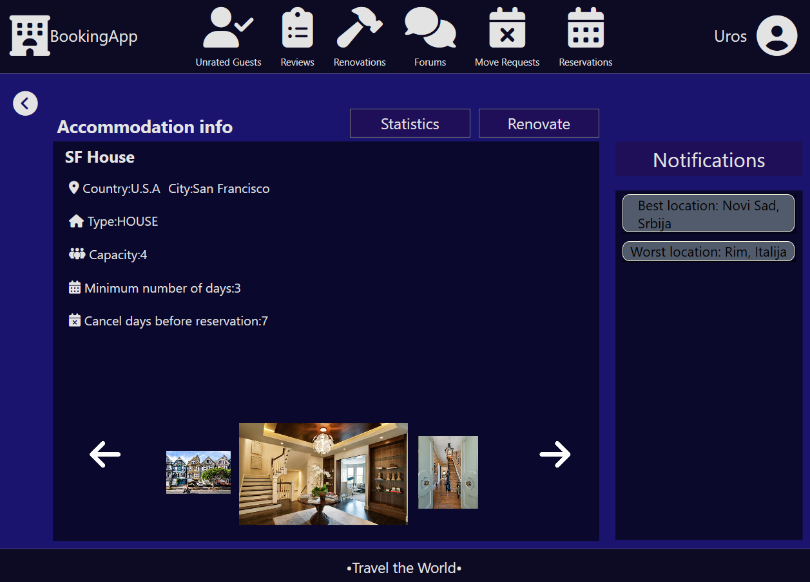
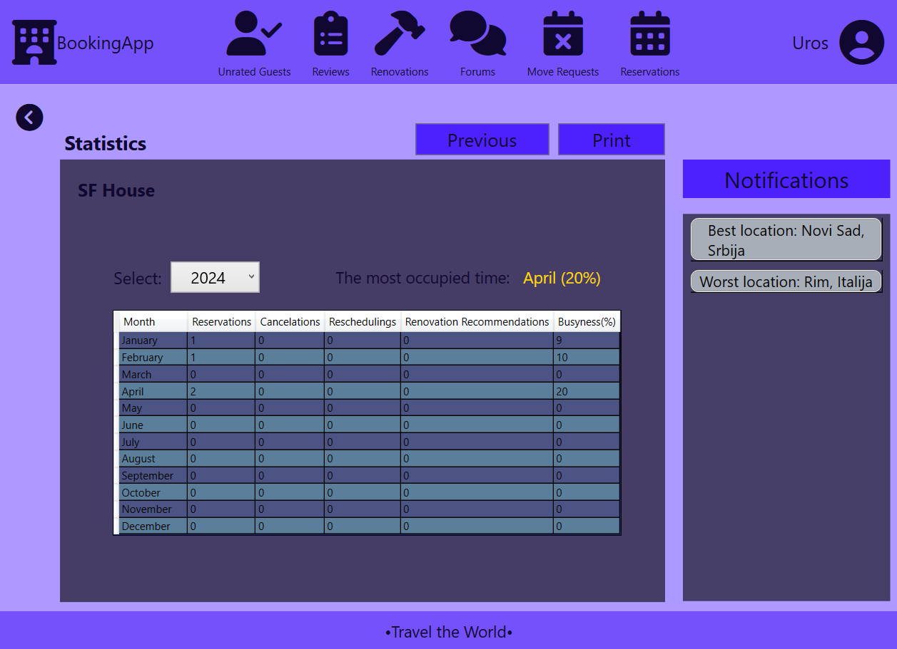
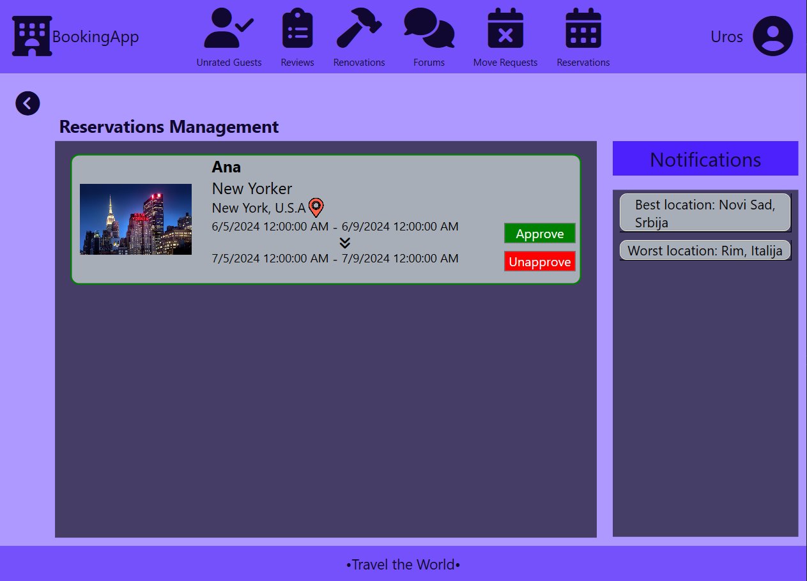
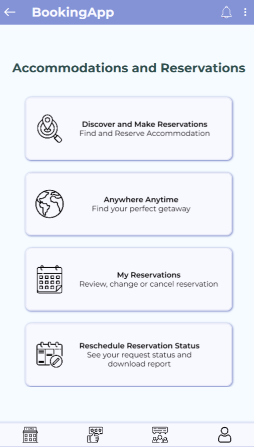
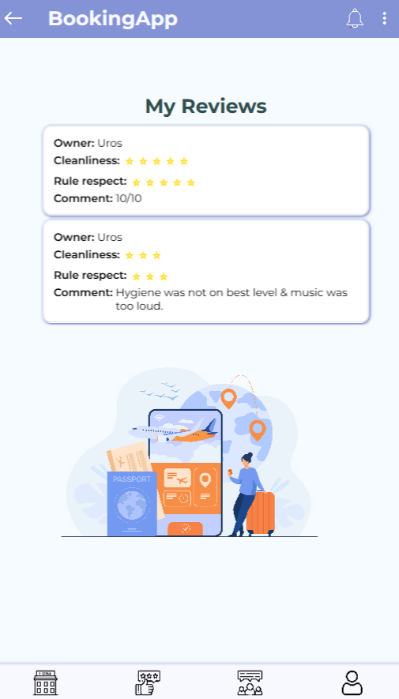
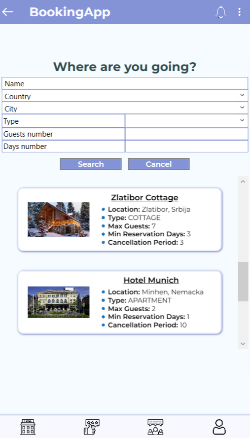
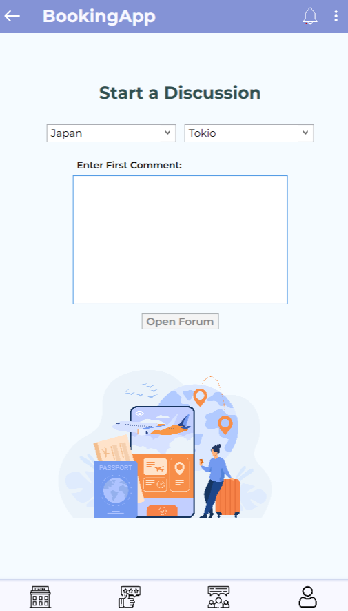

# Booking App

Academic Project for courses Software Specification and Modeling and Human-Computer Interaction,  
Faculty of Technical Sciences, University of Novi Sad

## About Project

Booking App is a WPF application developed using C# and XAML. It is designed for two different types of users (Owner and Guest), supporting two different devices – mobile and tablet. The project has largely adhered to the principles of clean code and the MVVM architecture, which were its primary objectives.

## Used Tools
► Microsoft Visual Studio 
► Balsamiq Wireframes 
► Draw.io

### Authors
► Ana Edelinski (Guest) 
► Uros Stanisavljevic (Owner)

## Screenshots

    
      

  
  

